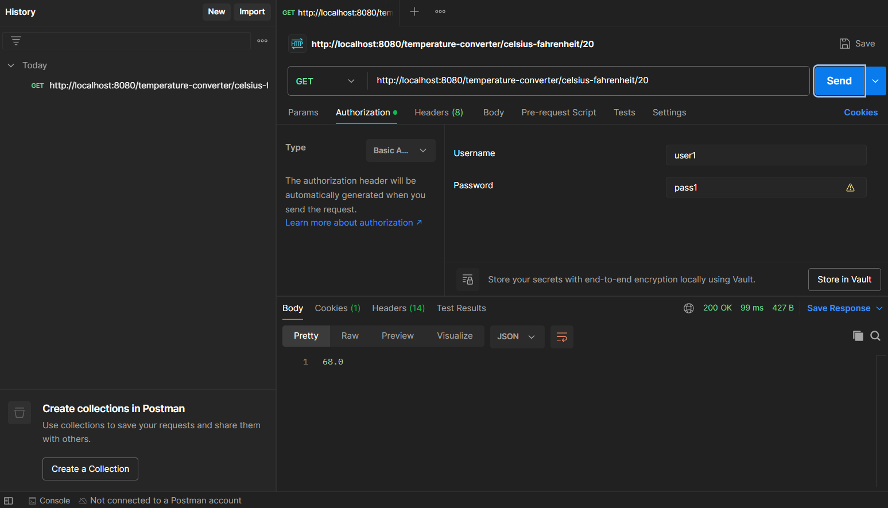
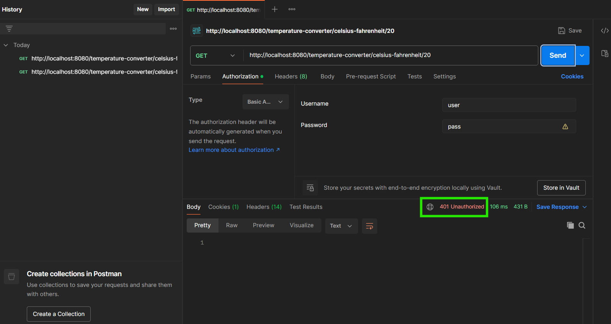

# lab9-converter
**COMPLETED BY:**

**Student Name:** Lolita Inabeza  
**Student Number:** 300218895

### Interaction avec l'API en utilisant Postman

**Authorized request**

**unauthorized request**

